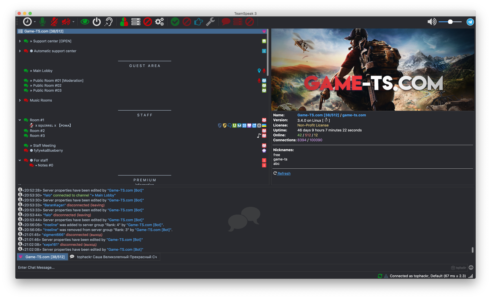

>❗ Info  
>MTV Theme out of support

## MJV

Dark mode with full information about channels people and the server.

## Content
- [Quick start](#quick-start)
- [Structure](#structure)
- [Contact](#contact)
- [Creators](#creators)
- [Copyright and license](#copyright-and-license)

## Quick start
### Download
- [Latest version](https://github.com/tophackr/MJV/releases/download/v1.1-r/MJV.ts3_style)
- [Buy latest version](https://gum.co/MJVTS3)

### Recommended
It's recommended to use icons with [DarkenTS Icon Pack](https://www.myteamspeak.com/addons/0b57d54d-b46c-433d-8f7e-2eea28470007) or [Material-Icons for Teamspeak (White)](https://www.myteamspeak.com/addons/4f8b0ebf-eb4a-4c37-9c4f-366813ffcf79)

## Structure
<pre>
styles/
├── MJV/
│   ├── gfx/
│   │   ├── plarforms/
│   │   │   ├── Android.svg
│   │   │   ├── FreeBSD.svg
│   │   │   ├── Linux.svg
│   │   │   ├── Mac.svg
│   │   │   ├── OS X.svg
│   │   │   ├── ServerQuary.svg
│   │   │   ├── Windows.svg
│   │   │   ├── iOS.svg
│   │   │   └── macOS.svg
│   │   ├── left.svg
│   │   ├── chat.svg
│   │   ├── check-off.svg
│   │   ├── check-on.svg
│   │   ├── down.svg
│   │   ├── ellipsish.svg
│   │   ├── ellipsisv.svg
│   │   ├── expand.svg
│   │   ├── right.svg
│   │   ├── separator.png
│   │   ├── splitter.svg
│   │   ├── times.svg
│   │   ├── toggle-off.svg
│   │   ├── toggle-on.svg
│   │   ├── tophackr.png
│   │   └── up.svg
│   ├── channelinfo.tpl
│   ├── clientinfo.tpl
│   ├── serverinfo.tpl
│   ├── tree_tooltip_channel.tpl
│   └── tree_tooltip_client.tpl
├── MJV.qss
├── MJV_chat.qss
└── MJV_mac.qss
</pre>

## Contact
If you have any problems, you can [open a new issue](https://github.com/tophackr/MJV/issues/new) or write an [email](mailto:tophackr@icloud.com).

## Creators
**Alexandr Musikhin**
- <https://twitter.com/tophackr_com>
- <https://github.com/tophackr>
- <https://tophackr.com>
- [TeamSpeak Server](https://l.tophackr.com/cySpmY989mPJ)

## Copyright and license
Code copyright 2018 the [MJV authors](https://github.com/tophackr/MJV/graphs/contributors). Code released under the [MIT License](https://github.com/tophackr/MJV/blob/master/LICENSE).
